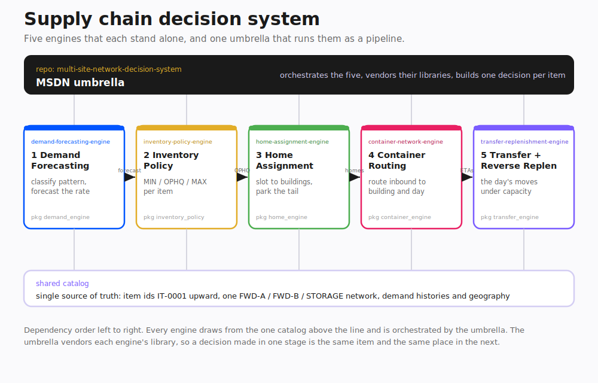

# Supply chain decision system

A working model of how a distribution network decides what to stock, where to put it,
and how to move it. Five engines, each solving one decision an operator actually faces,
and one umbrella that runs them as a single pipeline over a shared catalog. Every part
is real computation with tests and cited methods, not a slide.

## The arc

The engines follow the order the decisions happen in an operation:

    forecast demand  ->  set the stocking policy  ->  slot items to buildings
                     ->  route inbound containers  ->  plan the day's transfers

Each one is a standalone repository that runs on its own, and each one also imports as a
library so the next stage can call it. The umbrella, MSDN, wires all five together: one
catalog of items flows through the whole chain, and a decision made upstream is the same
item and the same place downstream.

## The five engines

Demand forecasting classifies each item by its demand pattern, using the
Syntetos-Boylan scheme, and routes each pattern to the method built for it, then judges
itself honestly by walking forward in time. It draws the distinction the rest of the
system leans on: an item that has never sold is new, not dead.

Inventory policy sets MIN, OPHQ, and MAX per item. It reproduces a real spreadsheet
formula faithfully, flaws and all, then fixes it with variability-based safety stock,
and proves the fix by measuring realized service level rather than asserting it. The
finding that drove the rebuild: the original applied service-level z-scores to mean
lead-time demand instead of to its standard deviation.

Home assignment slots items to buildings to minimize demand-weighted fulfillment cost
under cube capacity, and parks the non-moving tail in storage so it does not compete for
forward space. New items get a provisional forward home rather than being mistaken for
dead stock.

Container routing assigns whole inbound containers to a building and a day to maximize
demand coverage at a service level, under a daily unloading limit, and explains every
choice with a reason code.

Transfer and reverse replenishment plans the day's moves under a transfer capacity, on a
six-tier priority ladder from physical overflow relief down to returning excess to
reserve, and it reads inbound container ETAs so it does not move stock that is about to
arrive on its own.

## The umbrella

MSDN is the integration. It holds one shared catalog as the source of truth, vendors the
five engine libraries so it runs standalone, and uses thin adapters to translate the
catalog and each stage's output into the next engine's real inputs. Nothing is
reimplemented. The result is one master record per item that carries the whole decision:
pattern, forecast, policy, home, and the day's transfer tier, on a single row.

## What it shows

The through-line is operational: take a messy process a team runs by hand or by
spreadsheet, model the decision underneath it, build a system that makes a better call,
and prove the call is better on a metric that matters. The five engines show that across
distinct problem types. The umbrella shows the harder part, making separately built
systems compose into one pipeline with a shared contract and a fixed dependency order,
which is the same shape as integrating real tools and services into one workflow.

## Honest framing

The data is synthetic and seeded, so the numbers illustrate the mechanics, not a real
operation. MSDN plans a single period from one forecast rather than stepping time
forward. Each engine's README states its own limits. The point of the collection is the
engineering and the reasoning, shown end to end and reproducible.
