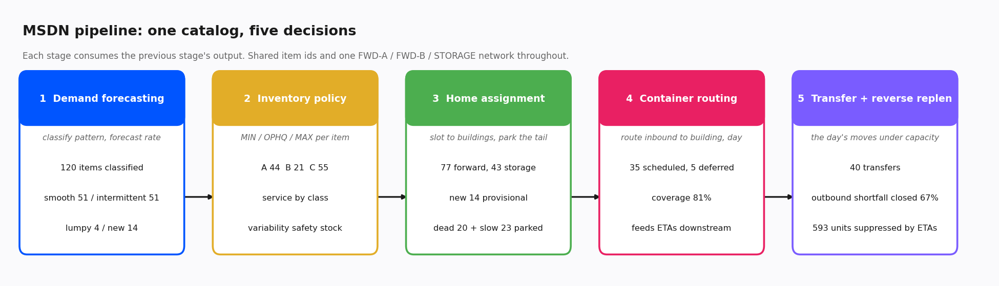

# MSDN: Multi-Site Network Decision System

Five supply-chain engines run as one pipeline over a single shared catalog. Demand
forecasting classifies and forecasts every item, inventory policy sets MIN, OPHQ, and
MAX, home assignment slots items to buildings and parks the non-moving tail, container
routing schedules inbound to buildings and days, and transfer plans the day's moves
under capacity. Each stage consumes the previous stage's output. Item ids and the
building network are shared throughout, so a decision made upstream is the same item
and the same place downstream.

This is the umbrella over five engines that each also stand alone. It vendors those
engine libraries under `vendor/` and adds an orchestration layer: a shared catalog, a
set of adapters that translate the catalog and accumulated outputs into each engine's
real input shape, and an orchestrator that runs them in dependency order. No engine
logic is reimplemented here. The adapters call the real vendored functions.

## The pipeline

The dependency order is fixed by what each engine needs:

    demand  ->  policy  ->  home  ->  container  ->  transfer

Demand comes first because everything keys off the forecast and the pattern
classification. Policy needs the forecast and lead times. Home assignment needs the
forecast, the movement classification, and the OPHQ footprint that policy produces.
Container routing needs the homes, because containers are pulled to the building an
item lives in. Transfer needs the policy triggers, the homes, and the container ETAs,
which tell it what is already inbound so it does not transfer something that is about
to arrive.

## One shared catalog, one network

The catalog is the single source of truth. It holds static master data only: each
item's weekly demand history, physical attributes, supplier lead time, and demand
geography, plus the network of buildings. It deliberately does not hold operational
positions like on-hand by location, today's orders, or inbound containers, because
those depend on upstream decisions. They are synthesized in the adapters from the
engines' outputs, which keeps the catalog from baking in a decision it should not own.

The network is two forward buildings and a reserve, named FWD-A, FWD-B, and STORAGE.
This is the naming the container and transfer engines already share, and the home
engine is driven with the same network through its state, so all three place items in
the same three locations. Item ids run IT-0001 upward across the whole system.

## The adapters

Each adapter builds one engine's inputs and calls it:

- Demand runs the real forecaster. It fits on the catalog's weekly histories, takes a
  one-step forward forecast per item, and classifies each item by the
  Syntetos-Boylan pattern scheme, including the never-sold versus sold-zero-recently
  distinction. It returns a forward demand rate and the classification.
- Policy builds an item frame with the forecast, lead times, and ABC class, then calls
  the improved policy to get MIN, OPHQ, and MAX with variability-based safety stock.
- Home builds the slotting state: forecast demand and geography, OPHQ footprint from
  policy, and the movement classification. Active and new items compete for forward
  cube, dead and slow items are parked in storage. New items get a provisional forward
  home rather than being mistaken for dead. The dead-or-slow gate reads recent observed
  demand, not the smoothed forecast, so an item that stopped selling reads as dead.
- Container builds the forward item set from the homes, synthesizes inbound containers
  targeting those buildings, and calls the router to schedule them to a building and a
  day at a service level under a daily unloading limit.
- Transfer builds the day's positions from policy and homes, feeds the container ETAs
  in as inbound so near-term arrivals suppress redundant moves, and runs the six-tier
  ladder under transfer capacity.

## Results

One run on the synthetic catalog, 120 items over 52 weeks on the shared network.
Illustrative, from the included pipeline:

| stage | outcome |
| --- | --- |
| demand | 120 items classified and forecast, patterns spread across smooth, intermittent, lumpy, and new |
| policy | ABC split roughly A 44 / B 21 / C 55, service targets by class |
| home | 77 forward (63 active, 14 new provisional), 43 storage (23 slow, 20 dead) |
| container | 35 of 40 containers scheduled, 5 deferred, about 81 percent demand coverage |
| transfer | 40 moves, about 67 percent of outbound shortfall closed, about 590 units of moves suppressed because the stock is already inbound |

The 20 dead items come straight through from the catalog's dead cohort and land in
storage with no policy, while the 14 never-sold items get provisional forward homes.
That the two are handled differently, end to end, is the point of threading the demand
engine's full classification through the whole pipeline.

The output is one master record per item, `data/network_decisions_sample.csv`, with the
whole decision for each item on one row: pattern and bucket, forecast rate, ABC and
service level, MIN / OPHQ / MAX, placement class, primary and fallback home, whether it
carries a policy, and its transfer tier for the day.

## Running it

    pip install -r requirements.txt
    python scripts/run_pipeline.py

That runs all five stages, prints a summary, and writes the figure and the master CSV.
Or from Python:

    from msdn import run_pipeline
    state = run_pipeline(seed=42)
    print(state.summary())

## Design decisions and honest limitations

This is a single-period snapshot, not a rolling simulation. It plans one day's
decisions from one forecast, and does not step time forward or feed realized outcomes
back. The data is synthetic and seeded, so the numbers illustrate the mechanics rather
than any real operation.

The network is two forward buildings and a reserve. That keeps every engine on the same
footing, but the home assignment has less room to differentiate than it would across
more buildings. The adapters synthesize operational positions, on-hand by location,
orders, and inbound containers, from upstream outputs and seeded randomness, since the
catalog holds only master data. And the demand rate is a one-step forward forecast used
as a planning rate, not a full multi-horizon forecast. Each of these is a place the
system would deepen in a real deployment.

## Repository layout

    src/msdn/
      catalog.py       the shared catalog: master data and the network
      adapters.py      project the catalog into each engine's real inputs, call it
      orchestrator.py  run the five engines in dependency order, build the master record
      state.py         the unified MSDN state and its summary
      report.py        the pipeline figure and the run summary
      _engines.py      put the vendored engines on the import path
    vendor/            the five engine libraries, bundled so this runs standalone
    scripts/run_pipeline.py
    tests/
    assets/  data/

## References

The umbrella is a straightforward orchestration pattern: a shared master catalog, thin
adapters to each component's contract, and a fixed dependency order. Each engine carries
its own references for its method. The classification that threads through the pipeline
is Syntetos, A. A., and Boylan, J. E. (2005), The accuracy of intermittent demand
estimates, International Journal of Forecasting, 21(2), 303-314. The slotting,
container, policy, and transfer stages draw on standard warehouse and inventory theory
cited in their own engine READMEs.
